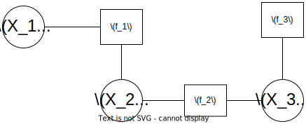
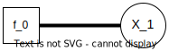
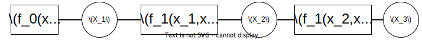
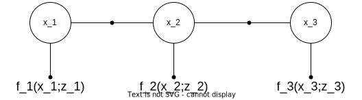

# Factor Graphs and GTSAM
- Before we begin, let's build GTSAM (since it takes some time)

**Install GTSAM**
Add PPA
```
sudo add-apt-repository ppa:borglab/gtsam-develop
sudo apt update
```
Install:
`sudo apt install libgtsam-dev libgtsam-unstable`

---

## Factor Graphs
- A factor graph is a bipartite graphical model representing the factorization of a function
- Can be used to model complex inference (estimation) problems
- Variables,  $X_n$, can represent unknown desired variables
- Factors, $f_n$,  connect these variables and define their relationships
- For example, a joint probability distribution can be represented as
$$
p(V)=\prod_{j}^{N_{f}} f_{j}\left(V_{j}\right)
$$


---
## Factor Graphs



---
## GTSAM 
- GTSAM is a sensor fusion library based on factor graphs
- Very large library, has support for SLAM, Kalman filtering, Lie algebra etc.
- Documentation is lacking, but lots of examples provided
- Main modules: `Base`, `Geometry`, `Navigation`, `SLAM`, `Nonlinear`
- Their use is best explained through examples

---
## Examples: 
We will demonstrate the use of GTSAM through a few examples
1. Simple Rotation
2. Modelling Robot Motion
3. Robot Localization 
4. SLAM


---
### 1. Simple Rotation
This example is a simple example of optimizing a single variable with a single prior factor 
- Variables: $X_1$, with represents a 2D rotation 
- Factors: $f_0$

We will create a goal angle of $30\degree$, with an initial guess of $20\degree$

---
### 1. Simple Rotation Cont'd
The factor graph would look like:
 
<br/><br/> 
<br/> 
You can open `GTSAM-tutorial/src/SimpleRotation.cpp` to follow along

---
<style scoped>section { font-size: 30px; }</style>
### 1. Simple Rotation
Header includes:
- `#include <gtsam/geometry/Rot2.h>`: 2D rotation is variable of interest
- `#include <gtsam/inference/Symbol.h>`: Simple header for symbols (X1 X2 etc)
- `#include <gtsam/nonlinear/NonlinearFactorGraph.h>:` Our factors are nonlinear
- `#include <gtsam/nonlinear/Values.h>`: GTSAM requires we use an initial guess for each variable, which we must hold in a Values container.
- `#include <gtsam/nonlinear/LevenbergMarquardtOptimier.h>`: MAP solver used (there are others)

---
### 1. Simple Rotation Cont'd
Create the unary factor (measurement data from sensor)
To create a factor we need:
  1. A key or set of keys to label the variables
  2. A measurement value
  3. A measurement model
```c++
Rot2 prior = Rot2::fromAngle(30 * degree);  // create measurement value
prior.print("goal angle");
auto model = noiseModel::Isotropic::Sigma(1, 1 * degree); // create measurement model
Symbol key('x', 1); // create key
```

---
### 1. Simple Rotation Cont'd
Now we can create the graph container and add the factor to it
```c++
NonlinearFactorGraph graph;
graph.addPrior(key, prior, model);
graph.print("full graph");
```

---
### 1. Simple Rotation Cont'd 
Create an initial estimate before optimizing
```c++
Values initial;
initial.insert(key, Rot2::fromAngle(20*degree));
initial.print("initial estimate");
```
Now optimize
```c++
Values result = LevenbergMarquardtOptimizer(graph, initial).optimize();
result.print("final result");
```

---
### 1. Simple Rotation Cont'd
The output is as follows
<style scoped>section { font-size: 30px; }</style>

```bash
goal angle: 0.523599
full graphsize: 1

Factor 0: PriorFactor on x1
  prior mean: : 0.523599
isotropic dim=1 sigma=0.0174533

initial estimateValues with 1 values:
Value x1: (gtsam::Rot2) : 0.349066

final resultValues with 1 values:
Value x1: (gtsam::Rot2) : 0.523599

```

---
#### 2. Modelling Robot Motion
- Variables: $x_1, x_2, x_3$ representing robot pose
- Factors
  - $f_0(x_1)$ , a unary factor on pose $x_1$ encoding our prior knowledge of the state
  - $f_1(x_1,x_2:o_1)$, a binary factor relating $x_1$ and $x_2$, and odom data $o_1$
  - $f_2(x_2,x_3:o_2)$, similar to $f_1$

A visual representation is in the next slide

---
#### Modelling Robot Motion


<br/>
<br/>
<br/>
Open `robotMotion.cpp` to follow along

---
#### Importing libraries
<style scoped>section { font-size: 34px; }</style>
`#include <gtsam/geometry/Pose2.h>`: We will use Pose2 variables (x, y, theta) to represent the robot positions
`#include <gtsam/slam/BetweenFactor.h>`: Between factors used to describe relative motion between odom measurments
`#include <gtsam/nonlinear/NonlinearFactorGraph.h>`: Nonlinear factor graph
`#include <gtsam/nonlinear/LevenbergMarquardtOptimizer.h>`: MAP Solver
`#include <gtsam/nonlinear/Marginals.h>`: marginals covariance
`#include <gtsam/nonlinear/Values.h>`: store initial guesses in values container

---

// Create an empty nonlinear factor graph
```c++
NonlinearFactorGraph graph;
```

Remember, for a factor we need three things:
  1. A key or set of keys to label the variables
  2. A measurement value
  3. A measurement model

---
<style scoped>section { font-size: 30px; }</style>
Create prior value of pose 1, setting it to origin
```c++
Pose2 priorMean(0.0,0.0,0.0);
```
Create prior noise model
```c++
noiseModel::Diagonal::shared_ptr priorNoise = 
  noiseModel::Diagonal::Sigmas(Vector3(0.3, 0.3, 0.1));
```
Create a key for this factor (we can use symbols like before, or an int).
We can now create this factor and add it to the graph
```c++
int key_1 = 1;
graph.add(PriorFactor<Pose2>(key_1, priorMean, priorNoise));
```

---
Create odometry factor values and measurment model
```c++
gtsam::Pose2 odometry(2.0, 0.0, 0.0);
noiseModel::Diagonal::shared_ptr odometryNoise = 
  noiseModel::Diagonal::Sigmas(Vector3(0.2, 0.2, 0.1));
// for keys we will just use int 2 and int 3
```
Add to factor graph
```c++
graph.add(BetweenFactor<Pose2>(1, 2, odometry, odometryNoise));
// we will use the same odom measurment (since its relative motion)
graph.add(BetweenFactor<Pose2>(2, 3 odometry, odometryNoise));
```
---
<style scoped>section { font-size: 28px; }</style>
We can print the summary so far
```
graph.print("\nFactor Graph:\n"); // print
```
Output:
```bash
Factor Graph:
size: 3

Factor 0: PriorFactor on 1
  prior mean: (0, 0, 0)
  noise model: diagonal sigmas[0.3; 0.3; 0.1];

Factor 1: BetweenFactor(1,2)
  measured: (2, 0, 0)
  noise model: diagonal sigmas[0.2; 0.2; 0.1];

Factor 2: BetweenFactor(2,3)
  measured: (2, 0, 0)
  noise model: diagonal sigmas[0.2; 0.2; 0.1];
```

---
To optimize, we need initial values (guesses)
```c++
  Values initial;
  initial.insert(1, Pose2(0.5, 0.0, 0.2));
  initial.insert(2, Pose2(2.3, 0.1, -0.2));
  initial.insert(3, Pose2(4.1, 0.1, 0.1));
  initial.print("\nInitial Estimate:\n"); // print
```
Optimize using Levenberg-Marquardt optimization
```c++
Values result = LevenbergMarquardtOptimizer(graph, initial).optimize();
```

---
<style scoped>section { font-size: 25px; }</style>
Output
```c++
result.print("Final Result:\n");
  ```

```
Initial Estimate:
Values with 3 values:
Value 1: (gtsam::Pose2) (0.5, 0, 0.2)

Value 2: (gtsam::Pose2) (2.3, 0.1, -0.2)

Value 3: (gtsam::Pose2) (4.1, 0.1, 0.1)

Final Result:
Values with 3 values:
Value 1: (gtsam::Pose2) (7.46978302e-16, -5.34409093e-16, -1.7838186e-16)

Value 2: (gtsam::Pose2) (2, -1.09236635e-15, -2.48671177e-16) 

Value 3: (gtsam::Pose2) (4, -1.70076055e-15, -2.5094386e-16) 
```
recall ground truth is x1 = (0, 0, 0), x2 = (2,0,0), and x3 = (2+2=4, 0, 0)

---
<style scoped>section { font-size: 25px; }</style>
We can also calculate the marginal covariance matrix
```c++
  cout.precision(2);
  Marginals marginals(graph, result);
  cout << "x1 covariance:\n" << marginals.marginalCovariance(1) << endl;
  cout << "x2 covariance:\n" << marginals.marginalCovariance(2) << endl;
  cout << "x3 covariance:\n" << marginals.marginalCovariance(3) << endl;
```
Result:
```
x1 covariance:
   0.09 2.4e-33 2.8e-33
2.4e-33    0.09 1.9e-17
2.8e-33 1.9e-17    0.01
x2 covariance:
   0.13 1.2e-18 6.1e-19
1.2e-18    0.17    0.02
6.1e-19    0.02    0.02
x3 covariance:
   0.17 8.6e-18 2.7e-18
8.6e-18    0.37    0.06
2.7e-18    0.06    0.03
```
---
# Questions so far?
- We have done examples 1 (sngle unary factor and optimization), and example 2 (multiple binary factors)
- Next is example 3: Robot Localization
---

## Example 3: Robot Localization
- The previous example relies on odometry measurments, but they aren't entirely accurate.
- They also rely on the previous factor, which can lead to error proagation.
- A more reliable approach is to use unary measurment factors at each continuous variable 
- This is especially applicable to robot localization

---



Open `robotLocalization.cpp` to follow along
</br>
</br>
</br>
</br>
- Here we use bullets for factors instead of squares.
- $x$ are the variables (poses), and $z$ represents the measurement.
- We will use GPS measurements 
---
<style scoped>section { font-size: 30px; }</style>

Pull headers

`#include <gtsam/geometry/Pose2.h>`: Variables will be pose2
`#include <gtsam/inference/Key.h>`: We will use symbolic keys instead of ints
`#include <gtsam/slam/BetweenFactor.h>`: Between variable factors
`#include <gtsam/nonlinear/Values.h>`: Value container to store initial guesses
`#include <gtsam/nonlinear/LevenbergMarquardtOptimizer.h>`: MAP solver
`#include <gtsam/nonlinear/Marginals.h>`: To compute marginal covariance matrix
`#include <gtsam/nonlinear/NonlinearFactor.h>`: Non linear factor graph

---
<style scoped>section { font-size: 25px; }</style>
First we can create a custom class for the unary factors (for GPS measurments). 
It inherits from `NoiseModelFactor`
```c++
class UnaryFactor: public NoiseModelFactor1<Pose2> {
  double mx_, my_; // define the x and y locations
public: 
  // define a shorthand for shared_ptr
  typedef boost::shared_ptr<UnaryFactor> shared_ptr; 

// create constructor and also pass it the initiated list for the parent class
UnaryFactor(Key j, double x, double y, const SharedNoiseModel& model):
  NoiseModelFactor1<Pose2>(model, j), mx_(x), my_(y) {}

~UnaryFactor() override {}
// override evaluateError and clone functions, since we are using a custom class
Vector evaluateError(const Pose2& q, boost::optional<Matrix&> H = boost::none) const override {
    const Rot2& R = q.rotation();
    if (H) (*H) = (gtsam::Matrix(2, 3) << R.c(), -R.s(), 0.0, R.s(), R.c(), 0.0).finished();
    return (Vector(2) << q.x() - mx_, q.y() - my_).finished();
}
// the math for this is in the code 
gtsam::NonlinearFactor::shared_ptr clone() const override {
  return boost::static_pointer_cast<gtsam::NonlinearFactor>(
      gtsam::NonlinearFactor::shared_ptr(new UnaryFactor(*this))); } };
```

---

Now main function:

```c++
int main(int argc, char**argv){
  // 1. Create a factor graph container and add factors to it
  NonlinearFactorGraph graph;

  // add odometry factors
// create noise model
auto odometryNoise = noiseModel::Diagonal::Sigmas(Vector3(0.2, 0.2, 0.1));
// add to factor graph (we use direct pose2 definitiions here)

graph.emplace_shared<BetweenFactor<Pose2> >(1, 2, Pose2(2.0, 0.0, 0.0), odometryNoise);
graph.emplace_shared<BetweenFactor<Pose2> >(2, 3, Pose2(2.0, 0.0, 0.0), odometryNoise);

```

---
Add GPS measurements

```c++
// create noise model
auto unaryNoise =
      noiseModel::Diagonal::Sigmas(Vector2(0.1, 0.1));  // 10cm std on x,y
// add the three unary factors to the graph 
graph.emplace_shared<UnaryFactor>(1, 0.0, 0.0, unaryNoise);
graph.emplace_shared<UnaryFactor>(2, 2.0, 0.0, unaryNoise);
graph.emplace_shared<UnaryFactor>(3, 4.0, 0.0, unaryNoise);
graph.print("\n Factr Graph:\n");
```
---

Result of print:
<style scoped>section { font-size: 25px; }</style>
```
Factor Graph:
size: 5

Factor 0: BetweenFactor(1,2)
  measured: (2, 0, 0)
  noise model: diagonal sigmas[0.2; 0.2; 0.1];

Factor 1: BetweenFactor(2,3)
  measured: (2, 0, 0)
  noise model: diagonal sigmas[0.2; 0.2; 0.1];

Factor 2:   keys = { 1 }
isotropic dim=2 sigma=0.1

Factor 3:   keys = { 2 }
isotropic dim=2 sigma=0.1

Factor 4:   keys = { 3 }
isotropic dim=2 sigma=0.1
```

---
To optimize, we need initial guesses
```cpp
Values initialEstimate;
initialEstimate.insert(1, Pose2(0.5, 0.0, 0.2));
initialEstimate.insert(2, Pose2(2.3, 0.1, -0.2));
initialEstimate.insert(3, Pose2(4.1, 0.1, 0.1));
initialEstimate.print("\nInitial Estimate:\n");  // print
```
Results:
```
Initial Estimate:
Values with 3 values:
Value 1: (gtsam::Pose2) (0.5, 0, 0.2)
Value 2: (gtsam::Pose2) (2.3, 0.1, -0.2)
Value 3: (gtsam::Pose2) (4.1, 0.1, 0.1)
```

---
<style scoped>section { font-size: 30px; }</style>
Optimize:
```cpp
LevenbergMarquardtOptimizer optimizer(graph, initialEstimate);
Values result = optimizer.optimize();
result.print("Final Result:\n");
```
Results
```
Final Result:
Values with 3 values:
Value 1: (gtsam::Pose2) (8.53538039e-11, 2.35867311e-12, 6.46369985e-11)
Value 2: (gtsam::Pose2) (2, -4.74793416e-12, 5.98996275e-11)
Value 3: (gtsam::Pose2) (4, 2.38926105e-12, 5.99195006e-11)
```
recall ground truth is $x_1 = (0, 0, 0), x_2 = (2,0,0), \text{and } x_3 = (4, 0, 0)$

---
<style scoped>section { font-size: 25px; }</style>

Covariance
```
Marginals marginals(graph, result);
  cout << "x1 covariance:\n" << marginals.marginalCovariance(1) << endl;
  cout << "x2 covariance:\n" << marginals.marginalCovariance(2) << endl;
  cout << "x3 covariance:\n" << marginals.marginalCovariance(3) << endl;
```
Result:
```
x1 covariance:
  0.00828571429  7.82228372e-14 -2.06607043e-13
 7.82228372e-14   0.00944444444  -0.00305555556
-2.06607043e-13  -0.00305555556   0.00819444445
x2 covariance:
  0.00714285714  3.80266543e-14 -5.38289642e-14
 3.80266543e-14   0.00777777778  -0.00111111111
-5.38289642e-14  -0.00111111111   0.00819444444
x3 covariance:
 0.00828571429 6.60868131e-14 1.73935528e-13
6.60868131e-14  0.00944444444  0.00305555556
1.73935528e-13  0.00305555556   0.0181944444
```